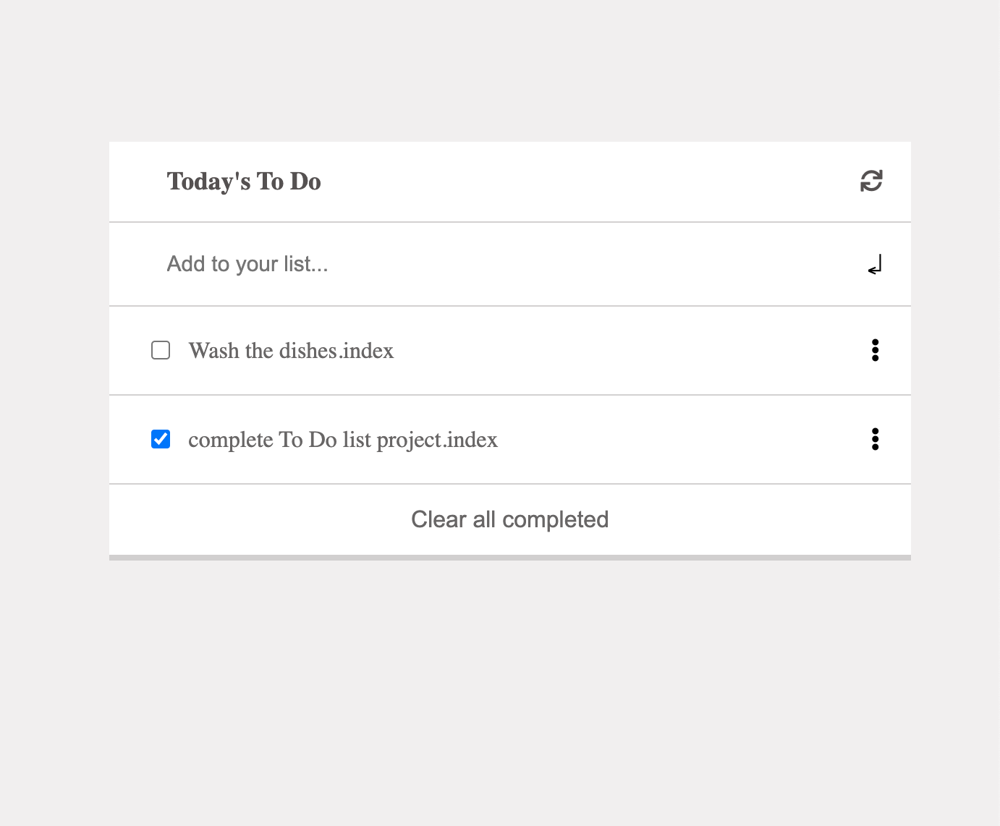

# to do List
> To do list is a simple CRUD application that allows you to add, delete, update tasks that you are supposed to do.

## Built With
- HTML-5
- CSS3
- Javacript
- Webpack
- Linters

## Getting Started
- To get a local copy up and running follow these simple example steps.
### Prerequisites
- You only need a browser to run the html file in.
### Setup
- Create a new folder to store the files in.
### Install
- Open your command prompt or terminal and run.
- git clone <branch-name>.
### Run tests

- To run tests run :
- npx hint .
- npx stylelint "**/*.{css,scss}"

### Deployment

- Project is deployed using
- git push <branch_name>
## Authors

👤 **Author**
- GitHub: [@iLynette](https://github.com/iLynette)
- Twitter: [@acholah_lynette](https://twitter.com/acholah_lynette)
- LinkedIn: [acholah lynette](https://www.linkedin.com/in/lynette-acholah/)

## 🤝 Contributing

Contributions, issues, and feature requests are welcome!

Feel free to check the [issues page](../../issues/).
## :memo: License
This project is [MIT](./MIT.md) licensed.